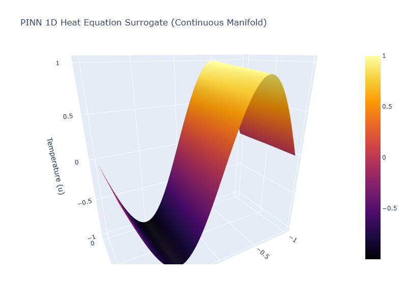

# Fabric Report: 1D Heat Equation PINN

## Visualizing the Continuous Manifold
Below is the 3D surface plot demonstrating the initial sine wave at t=0 diffusing smoothly over time, strictly constrained by the frozen boundaries.

## Interactive Simulation
You can download and interact with the fully rotatable 3D physics tensor in your own browser using the link below:

[Download the Interactive 3D Fabric Simulation](../data/pinn_3d_fabric.html)

---

## The Operator Horizon: Fourier Neural Operators (FNOs)
While the trained PINN accurately simulates the 1D Heat Equation, it is limited to a single initial condition. Observer-Prime explains how Fourier Neural Operators solve this scalability problem:

* **Mapping Functional Spaces:** Unlike standard PINNs that learn a specific mapping from finite coordinate inputs (x, t) to a scalar output, FNOs are designed to map entire infinite-dimensional functional spaces. This means they learn to take any given initial condition function as an input and map it directly to the corresponding solution function.
* **Frequency Domain Convolutions:** By using the Fast Fourier Transform (FFT) to convert spatial inputs into the frequency domain, FNOs perform convolutions on the spectral representation. This allows the network to efficiently capture global physical dependencies and continuous patterns, making the architecture completely independent of grid resolution.
* **Zero-Shot Predictions:** Because the FNO learns the underlying differential operator—the actual physical rules governing the system—rather than overfitting to one specific scenario, it can instantly evaluate entirely new, unseen initial conditions in a single forward pass without requiring any retraining.