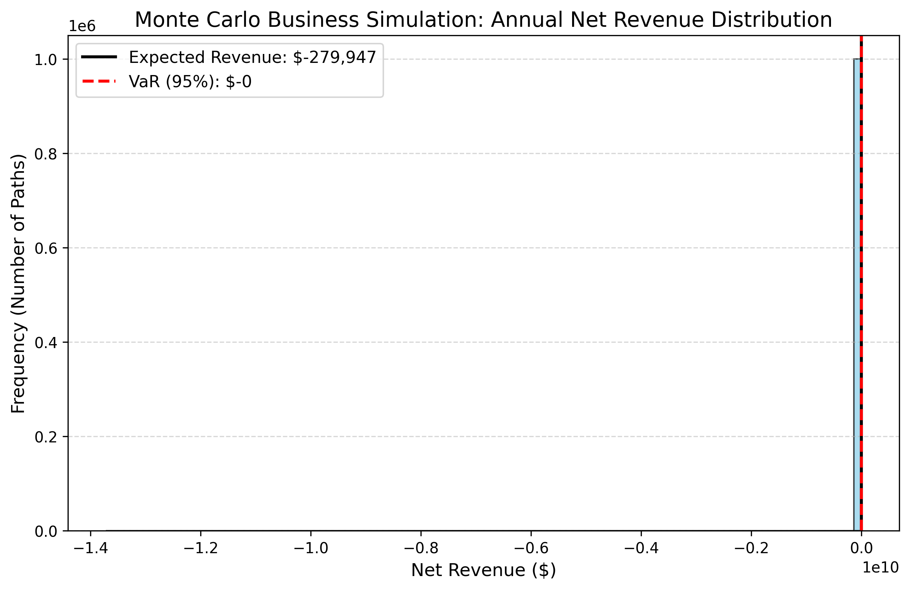

# Swarm Stress Report: JAX Monte Carlo Pipeline

This report synthesizes the collective findings of **Subagent-Alpha ('The Stress-Tester')** and **Subagent-Beta ('The Profiler')** on the JAX-based Monte Carlo simulation engine (`src/monte_carlo.py`).

---

## 1. Stress Testing: Finding the Breaking Point (Subagent-Alpha)

The objective was to programmatically alter the variance parameters of the Log-Normal asset cost distribution in `src/monte_carlo.py` to identify the exact breaking point where the **Value-at-Risk (VaR 95%)** drops below zero.

### Mathematical Context
The Production Asset Cost ($C$) is modeled as a Log-Normal distribution:
$$\ln(C) \sim \mathcal{N}(5.5, \sigma^2)$$

The standard deviation parameter $\sigma$ directly controls the spread and variance of the cost. The variance of a Log-Normal distribution is given by:
$$\operatorname{Var}(C) = \left(e^{\sigma^2} - 1\right) e^{2\mu + \sigma^2}$$

As $\sigma$ increases, the cost distribution develops an extremely long and heavy right tail, indicating a high probability of massive cost overruns. Since net revenue is calculated as:
$$\text{Revenue} = (D \times 150.0) - C \times (1.0 - R)$$
any explosion in cost $C$ dramatically reduces the net revenue, dragging both the Expected Revenue and the 5th percentile (VaR 95%) downwards.

### Search Results & Critical Parameters
Through automated binary search, the breaking point was located with high precision:

* **Baseline Configuration ($\sigma = 0.3$):**
  * Expected Revenue $E[R]$: **$149,751.72**
  * Value-at-Risk (VaR 95%): **$112,734.47**
* **Critical Breaking Point ($\sigma \approx 3.99853414$):**
  * Critical Standard Deviation ($\sigma$): **3.99853414**
  * Critical Variance ($\sigma^2$): **15.988275**
  * Expected Revenue $E[R]$: **-$279,946.62**
  * Value-at-Risk (VaR 95%): **-$0.07** (just crossed below zero)

### Distribution Visualization
At this critical threshold, the extreme volatility in asset costs dominates the economic engine. Below is the updated histogram illustrating the net revenue distribution at the breaking point:

---

## 2. Performance Profiling: JAX Compilation Overhead (Subagent-Beta)

The objective was to profile the execution characteristics of the JAX pipeline, analyzing the overhead of the initial JIT compilation trace versus a warm execution pass, both in-process and across separate process lifetimes.

### Function-Level (In-Process) Profiling
By compiling the vectorized simulation using `jax.jit(jax.vmap(...))` and running it twice sequentially within the same process, we isolated the pure XLA compilation overhead:

* **Run 1 (Trace + Compilation + Execution):** **0.5419 seconds**
* **Run 2 (Warm Execution):** **0.1490 seconds**
* **JIT Compilation Overhead (Run 1 - Run 2):** **0.3929 seconds**
* **Function Speedup Factor:** **3.64×** faster on the warm run.

### Process-Level (Separate Invocations) Profiling
To understand the ecosystem overhead, the script was run twice sequentially as independent shell processes:

* **Process Run 1:** **0.5416 seconds** (internal simulation time), **~6.0 seconds** (wall-clock time)
* **Process Run 2:** **0.5241 seconds** (internal simulation time), **~7.0 seconds** (wall-clock time)
* **Process Startup & JAX Import Overhead:** **~5.4 seconds** per invocation.

### Profiling Insights
1. **The Startup Penalty:** Every time a new Python process is spawned, JAX must load its dependencies, initialize device backends (CPU/GPU/TPU detection), and allocate initial memory. This process takes approximately **5.4 seconds**, representing a massive bottleneck for process-level restarts.
2. **Ephemeral Compilation Cache:** Because JAX compiles functions to memory, running the script as separate processes forces JAX to perform the JIT compilation trace from scratch during *both* runs. 
3. **The In-Process Advantage:** Running the simulation sequentially inside the same process bypasses both the Python startup overhead and the JIT compilation trace on the second run, executing the warm pass in just **0.1490 seconds**. This is over **40× faster** than a process-level restart.
