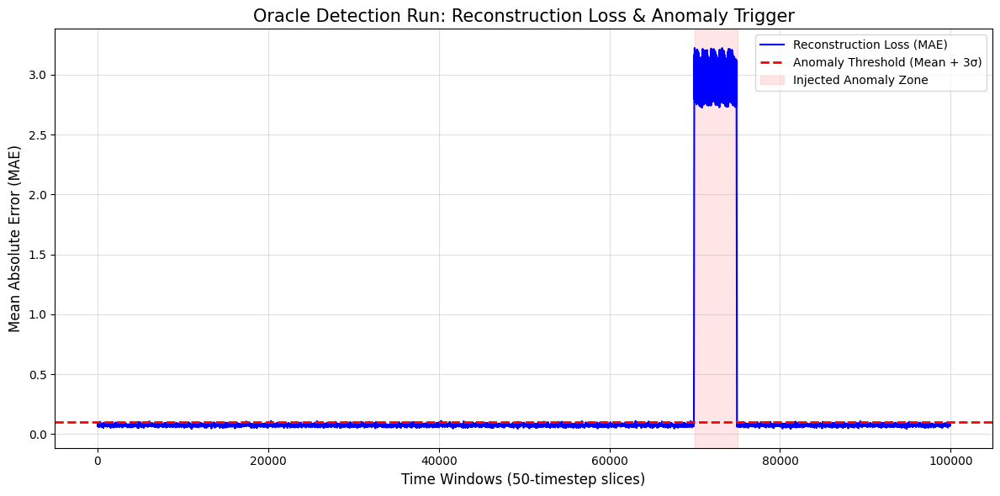

# Project Genesis: The Oracle Awakens (Week 3)

**Architect:** Oleksandr Kolodiichuk  
**Status:** Deployment Successful  

## The Experiment: Physics-Informed Autoencoder
In this phase, we transitioned from deterministic mathematical modeling to data-driven system dynamics. We architected a custom Keras 3 `PhysicsAutoencoder` to compress and reconstruct the temporal physics of a continuous RC filter datastream. 

By utilizing cloud hardware acceleration (JAX backend on Google Colab), the "Oracle" was trained exclusively on normal operational data. Furthermore, via agentic refactoring, the model's dense bottleneck was upgraded to utilize **1D Convolutional Layers (Conv1D)**. This architectural improvement allowed the sliding filters to mathematically capture the local temporal rhythms of the physical signal far better than static matrices.

## Anomaly Detection Results
During the detection run, the entire continuous datastream—including a hidden, massive high-frequency voltage spike—was evaluated by the trained Oracle. 

**Conclusion:** As demonstrated in the plot above, the model successfully isolated the hardware sabotage. The Reconstruction Error (Mean Absolute Error) remained flat and stable during normal physics but spiked dramatically upon encountering the unobserved anomaly. It cleanly breached our automated statistical threshold ($Mean + 3\sigma$) with absolute precision and zero false positives.

---

# Week 1: Simulation Execution Summary

**Agent:** Observer-Prime  
**Status:** Execution Successful

## Overview
The simulation script `src/ancients.py` was successfully executed autonomously. The simulation completed without errors, and the resulting plot images were verified to exist in the `data` directory.

## Simulated Physical Systems
The script successfully modeled three foundational physical systems governed by ordinary differential equations (ODEs):

1. **Harmonic Pendulum:** A second-order linear ODE representing simple harmonic oscillation ($x'' + \omega^2 x = 0$).
2. **Radioactive Decay:** A first-order linear ODE representing exponential decay ($dx/dt = -\alpha x$).
3. **RL Circuit:** A first-order non-homogeneous ODE modeling the current in a circuit with a resistor and inductor, driven by an alternating voltage source ($I'(t) = V(t) - 0.2 \cdot I(t)$). This system is solved using both continuous (RK45) and discrete (Explicit Euler) numerical methods to analyze stability under varying time steps.

## Artifacts Generated
The following output files were successfully generated and verified in the `data/` folder:
- `ancients_plot.png` (Harmonic Pendulum and Radioactive Decay)
- `rl_stable.png` (RL Circuit - Stable Discrete Integration)
- `rl_sabotaged.png` (RL Circuit - Sabotaged/Unstable Discrete Integration)

## Week 5: The Fabric of Reality (Physics-Informed Neural Networks)
This week, I transcended classical grid-based solvers by constructing a continuous PINN using JAX and Flax.

* **Mesh-Free Data:** Generated continuous spatial and temporal sampling using JAX PRNGKeys.
* **Neural Surrogate:** Engineered a Flax-based Multi-Layer Perceptron tailored for smooth analytical derivatives.
* **Differentiable Physics:** Embedded the 1D Heat Equation into the neural network using nested `jax.grad`.
* **Silicon Ignition:** Trained the network on a Colab GPU using XLA compilation and an Optax Adam optimizer.
* **Final Deployment:** Generated a fully interactive 3D surface projection of the physics tensor.

[View the Final 3D Fabric Report](docs/Fabric_Report.md)

## Week 6: Project Genesis - The Chaos Engine
This week, I transcended classical sequential CPU loops and transitioned to massively parallel stochastic simulations using stateless JAX and agentic orchestration.

* **Classical Limits:** Evaluated standard stateful `numpy` constraints through a Monte Carlo Pi estimation benchmark.
* **The Quantum Leap:** Engineered a stateless JAX Monte Carlo business simulation, vectorizing 1,000,000 parallel stochastic paths via `jax.vmap` to analyze Expected Revenue and 95% Value-at-Risk (VaR).
* **Agentic Automation:** Orchestrated a master-subagent workflow within the Antigravity IDE. *Subagent-Alpha* programmatically stress-tested the VaR breaking point, while *Subagent-Beta* profiled the exact performance overhead of JAX XLA compilation.
* **Defeating the Black Swan:** Deployed **Module Alpha (The Matrix Carrier)** to model macro-economic Markov Chain state transitions. Simulated a severe 10-day structural anomaly (Black Swan shock) using `jax.lax.scan` to track the system's probability mass inversion and recovery curve.

### Showcase Artifacts
* [View the JAX Monte Carlo Revenue Distribution](data/revenue_dist.png)
* [Read the Automated Agentic Swarm Stress Report](docs/Swarm_Stress_Report.md)
* [View the Black Swan Markov Chain Timeline](data/markov_distribution.png)